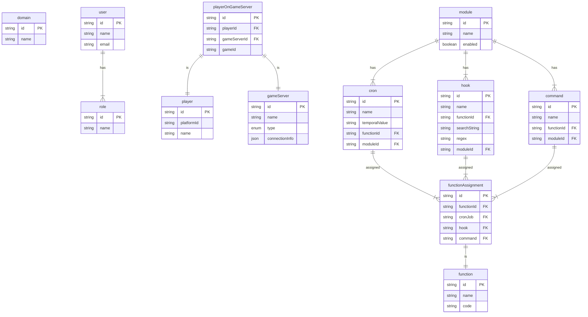

# Takaro

## Requirements

- Node 18.x
- Npm 8.x
- Docker
- Docker Compose

## Development setup

Run the init script from the root of the repo. This will install all development dependencies, it can take a while...

```bash
./scripts/dev-init.sh 

# While this is running, take a look at the generated .env file and adjust as needed
```

Start the development environment:

```bash
docker-compose up --build
```

There is a dashboard available where all the services are listed. You can access it at http://localhost:8080

Optionally (but recommended!), you can set up some testing data automatically.

```bash
# Take a look at the .env file and adjust as needed
./scripts/dev-data.sh
```

### Working on app-agent

 app-agent will run inside the dev container but it will use the 'local execution mode'. This means code is executed directly in-process, without isolation. **THIS IS EXTREMELY INSECURE for production deployments**. If you need to work on app-agent with the real isolation, you will need to run app-agent on your host directly. app-agent needs to execute nerdctl to talk to containerd. I haven't been able to get this properly setup in the docker-compose file.. :(.


```
# install https://github.com/containerd/nerdctl

# Install rootless
sudo apt install uidmap
containerd-rootless-setuptool.sh install
```

## Repo setup

This repo is a monorepo, using [NPM workspaces](https://docs.npmjs.com/cli/v7/using-npm/workspaces).

There are two types of packages; libraries (`lib-*`) and applications (`app-*`).

### Libraries

- Can be imported by other packages.
- Do not have a `start` script.
- Do have a `start:dev` script, typically, this runs the Typescript compiler in watch mode.

### Applications

- Can NOT be imported by other packages.
- Does have a `start` script, which runs the application in production mode.
- Does have a `start:dev` script, which runs the application with auto-reloading functionality.

## Database

