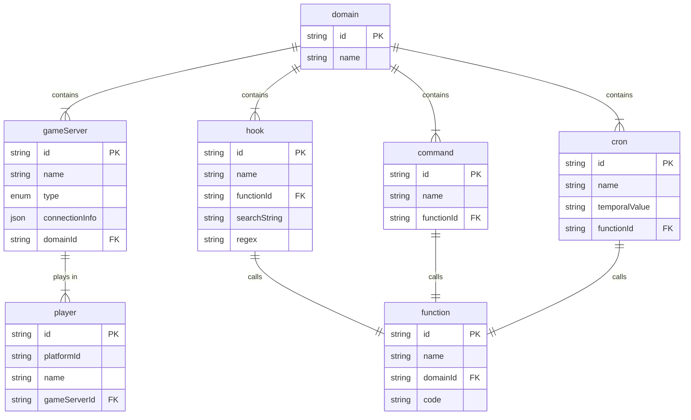

# Takaro

## Requirements

- Node 18.x
- Npm 8.x
- Docker
- Docker Compose

## Development setup

Run the init script from the root of the repo:

```bash
./scripts/dev-init.sh 
```

Start the development environment:

```bash
docker-compose up --build
```

## Repo setup

This repo is a monorepo, using [NPM workspaces](https://docs.npmjs.com/cli/v7/using-npm/workspaces).

There are two types of packages; libraries (`lib-*`) and applications (`app-*`).

### Libraries

- Can be imported by other packages.
- Do not have a `start` script.
- Do have a `start:dev` script, typically, this runs the Typescript compiler in watch mode.

### Applications

- Can NOT be imported by other packages.
- Does have a `start` script, which runs the application in production mode.
- Does have a `start:dev` script, which runs the application with auto-reloading functionality.

## Database

