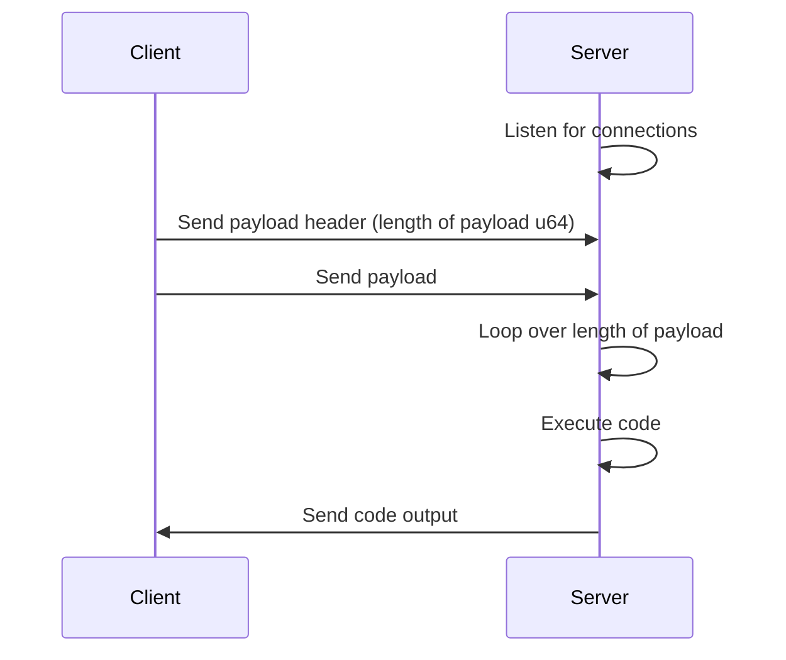

# Simple protocol

## Payload

| Column1 | Column2 |
| ------- | ------- |
| Header  | Item2.1 |

## Sequence Diagram

```mermaid
sequenceDiagram
    participant Client
    participant Server

    Server->>Server: Listen for connections


    Client->>Server: Send payload header (length of payload u64)
    Client->>Server: Send payload

    Server->>Server: Loop over length of payload
    Server->>Server: Execute code
    Server->>Client: Send code output
```
