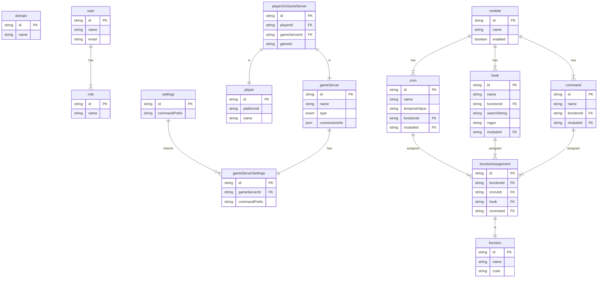

# Database

## Multi-tenancy

Takaro is a multi-tenant application. Each tenant (domain) has its own isolated set of data. This isolation is achieved by creating a separate [PostgreSQL database schema](https://www.postgresql.org/docs/current/ddl-schemas.html) for each domain. Once a user is authenticated via the API, all subsequent requests for this user will only be able to access one specific domain schema.

## Database structure

