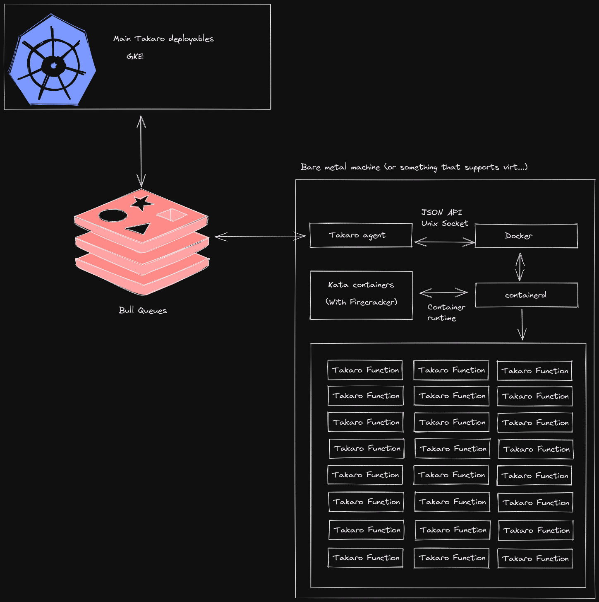

# Functions isolation

Takaro uses Kata containers to run containers isolated by VMs. 



## containerd communications

We can use the [Docker Engine API](https://docs.docker.com/engine/api/v1.41/) to manage container instances. Kata containers works here since Kata is "just" a container runtime.

## Installing Kata containers on Hetzner


- TODO: This needs to be packaged up somehow. Maybe we can create an image with Packer?
- TODO: I used the CentOS Stream 8 image from Hetzner. I think this is the same/similar as Rocky Linux? We can also use the snapd install method if we want to stick with Ubuntu servers.
- TODO: Using Qemu as a backend now. If we switch to Firecracker, creating containers should become a lot faster.

Kata containers has some specific requirements to be installed. At time of writing, I (Cata) have a machine setup on Hetzner. These are the steps I took:

Start with a CentOS 8 machine. 

Install Kata containers:

```bash
dnf update -y

sudo -E dnf install -y centos-release-advanced-virtualization
sudo -E dnf module disable -y virt:rhel
source /etc/os-release
cat <<EOF | sudo -E tee /etc/yum.repos.d/kata-containers.repo
[kata-containers]
name=Kata Containers
baseurl=http://mirror.centos.org/\$contentdir/\$releasever/virt/\$basearch/kata-containers
enabled=1
gpgcheck=1
skip_if_unavailable=1
EOF
sudo -E dnf install -y kata-containers
```

Install Docker (containerd) **(NOTE: not needed anymore since containerd is included in nerdctl I think...)**

```bash
sudo yum install -y yum-utils

sudo yum-config-manager \
    --add-repo \
    https://download.docker.com/linux/centos/docker-ce.repo

sudo yum install -y docker-ce docker-ce-cli containerd.io docker-compose-plugin    

sudo systemctl enable docker
sudo systemctl start docker

# Check if docker is working:
docker run hello-world
```

Check if Kata is working:

`kata-runtime check`

Run a test container:

`ctr run --runtime "io.containerd.kata.v2" --rm -t "docker.io/library/busybox:latest" test-kata sh`

Install [nerdctl](https://github.com/containerd/nerdctl)

Use the full install package from the releases page so you have the CNI plugins

```bash
curl -L -o nerdctl.tar.gz https://github.com/containerd/nerdctl/releases/download/v0.22.2/nerdctl-full-0.22.2-linux-amd64.tar.gz
sudo tar xzf nerdctl.tar.gz --directory=/usr/local

```


`nerdctl run --runtime "io.containerd.kata.v2" hello-world`