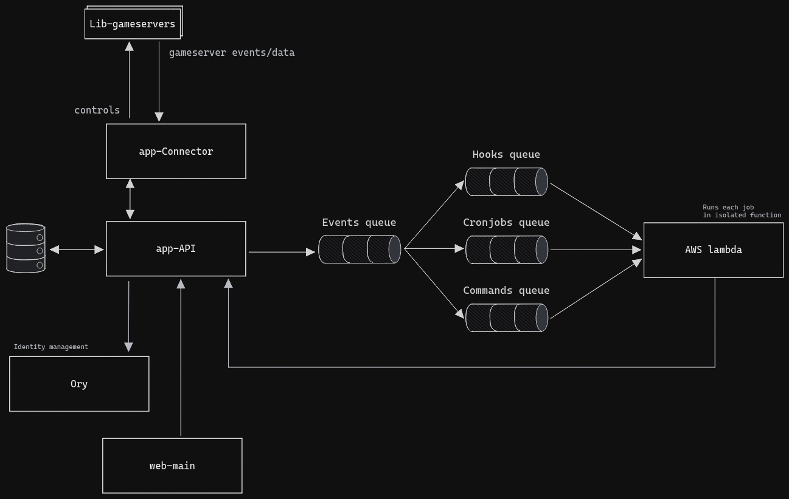

# Getting started

This document will guide you through installing Takaro locally for development. If you are a user of Takaro, you can skip this document and go straight to the [User Guide](/).

The Takaro development environment targets Unix devices (with a focus on Linux)! If you are on Windows, you can use [WSL](https://docs.microsoft.com/en-us/windows/wsl/install-win10).

## System diagram



## Requirements

- Git
- Node 18.x
- Npm 8.x
- Docker
- Docker Compose

## Development setup

**If you plan to make code changes, it's a good idea to first create a copy of the repo in your own Github account:
[Fork the repo](https://github.com/gettakaro/takaro/fork)
**

This is an opinionated development setup. It will get you up and running quickly.
It comes with a few services/tools/scripts that are useful for developing, testing and debugging.

Think of this as "Takaro in a box". It is not meant to be used as a production environment, but it will get you up and running quickly.

```bash
# Clone the repo
cd /to/where/you/want/to/clone/takaro
git clone git@github.com:gettakaro/takaro.git
cd takaro

# Run the init script from the root of the repo. This will install all development dependencies, it can take a while...
./scripts/dev-init.sh

# While this is running, take a look at the generated .env file and adjust as needed
```

Start the development environment:

```bash
docker compose up --build
```

At this point, everything should be running. There is a dashboard available where all the services are listed. You can access it at http://localhost:13337.

To view logs:

```sh
docker-compose logs -f

# Since Takaro has lots of services, you might want to filter the logs:
# For example, to only see only Takaro logs
docker-compose logs -f takaro
```

Optionally (but recommended!), you can set up some testing data automatically.

```bash
# Generate data for the standard development setup
docker compose exec takaro node scripts/dev-data.mjs
```

### Frontend only development

The full system is quite heavy and needs a lot of resources. If you are only working on the frontend, you can run the lightweight production containers and only run the frontend in dev mode

```bash
# Ensure your .env vars are loaded
# You can use direnv or related tools to automatically load the .env file
# Or you can run this ad-hoc command...
export $(cat .env | sed '/^#/d' | xargs)
# Start the backend services
docker compose -f deploy/compose/docker-compose.yml up -d
# Navigate to the web-main package
cd packages/web-main
# Start the dev server with some overrides for the backend services
VITE_ORY_URL=http://127.0.0.1:4433 VITE_API=http://127.0.0.1:13000 VITE_TAKARO_VERSION=1.0.0 npm run start:dev

# The frontend is available at http://localhost:13002
```

## Repo setup

This repo is a monorepo, using [NPM workspaces](https://docs.npmjs.com/cli/v7/using-npm/workspaces).

There are three types of packages; libraries (`lib-*`), applications (`app-*`) and web apps (`web-*`).

## Libraries

- Can be imported by other packages.
- Do not have a `start` script.
- Do have a `start:dev` script, typically, this runs the Typescript compiler in watch mode.

## Applications

- Can NOT be imported by other packages.
- Do have a `start` script, which runs the application in production mode.
- Do have a `start:dev` script, which runs the application with auto-reloading functionality.

## Web

- Similar to apps, but are intended to be deployed to a web server.
- Do have a `start:dev` script, which runs the application with auto-reloading functionality.
- Do have a `build` script, that outputs static HTML, CSS and JS files.
