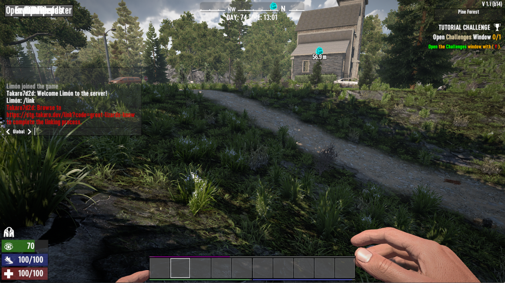

# Players

Takaro regularly syncs player data from your servers into the Takaro database. Online players get synced within intervals of a few seconds. If an event occurs, that data can be synced immediately.

## Global Player Profile

- Uniform Across All Servers: The global 'Player' profile remains consistent across all game servers. This profile represents the player's universal identity in Takaro.
- Tracks General Information: It includes global data such as the player's name, SteamID, and other platform-wide details.

## Server-Specific Player Profile (PlayerOnGameServer)

- Unique to Each Server: A 'PlayerOnGameServer' profile is created for each game server a player joins. This means a player will have separate profiles for each server they are part of.
Example Scenario: If a player plays on both your PvE and PvP servers, they will have two distinct 'PlayerOnGameServer' profiles, one for each server, but only one global 'Player' profile.

- Stores Server-Specific Data: This profile keeps track of server-specific information such as inventory, position, and other in-game details.

## Player Linking

Players can link to your community and receive login credentials to access it through Takaro. This feature allows players to visit the shop via the web browser.

### How to Link

1. In-game, type the command `/link`.

2. After entering the command, you'll receive a weblink.
4. Click the link to be redirected to Takaro, where you can create your user account.

5. Once linked, you'll have access to Takaro and the associated game community.

If you wish to link to another game community, simply repeat the `/link` process. Within Takaro, you can easily switch between game communities by using the domain widgets in the bottom left.
To know more about how to use the shop, please visit [Economy page](./economy.md).
